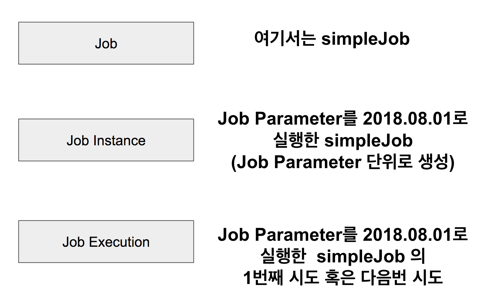

## Spring Batch 가이드 - 메타테이블엿보기
3. [Spring Batch 가이드 - 메타테이블엿보기](https://jojoldu.tistory.com/326)

- JOB_INSTANCE_ID
    - BATCH_JOB_INSTANCE 테이블의 PK
- JOB_NAME
    - 수행한 Batch Job Name

BATCH_JOB_INSTANCE 테이블은 **Job Parameter**에 따라 생성되는 테이블

### BATCH_JOB_INSTANCE
- Job Parameter
    > Spring Batch가 실행될때 외부에서 받을 수 있는 파라미터

Spring Batch에서는 해당 날짜 데이터로 조회/가공/입력 등의 작업

같은 Batch Job 이라도 Job Parameter가 다르면 Batch_JOB_INSTANCE에는 기록되며

**Job Parameter** 가 같다면 기록되지 않음
`JobInstanceAlreadyCompleteException` 예외 발생

### BATCH_JOB_EXECUTION
> JOB_EXECUTION와 JOB_INSTANCE는 부모-자식 관계  

JOB_EXECUTION은 자신의 부모 JOB_INSTACNE가 성공/실패했던 모든 내역을 갖고 있음

Spring Batch는 동일한 Job Parameter로 성공한 기록이 있을때만 재수행이 안됨

- JOB INSTANCE: 부모
- JOB EXECUTION: 자식

### BATCH_JOB_EXECUTION_PARAM
BATCH_JOB_EXECUTION 테이블이 생성될 당시에 입력 받은 Job Parameter를 담고 있음